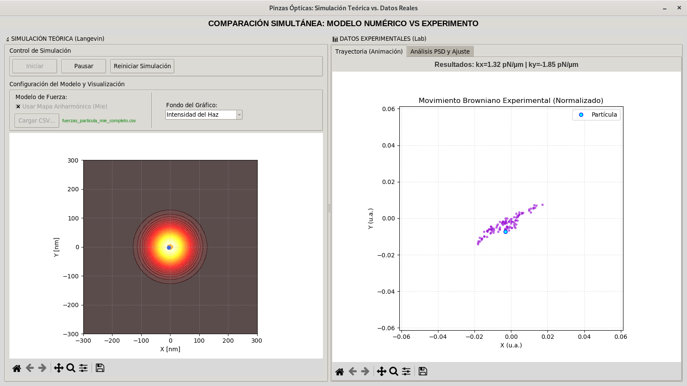
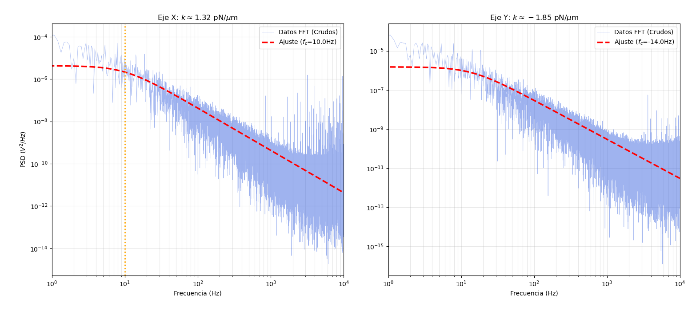

# Optical Tweezers Simulation & Analysis

> **Note:** This software combines stochastic numerical simulation with real experimental data analysis obtained from the Biophotonics Laboratory at CFATA (UNAM Juriquilla).

---

## 1. Visual Demo



---

## 2. Technical & Algorithmic Foundations

### Physical Modeling

The core of the simulator is based on the **Langevin Equation**, which describes the Brownian motion of a dielectric particle trapped in a harmonic potential.

Given the micro-scale environment within a fluid, the system operates in an **overdamped regime** (low Reynolds number), making the inertial term ($m\ddot{x}$) negligible. The implemented model uses the approximation:

$$\gamma \dot{x} = -k_{trap}x + F_{th}(t)$$

Where:

- $\gamma$: Viscous drag coefficient (Stokes' Law).
- $k_{trap}$: Optical trap stiffness.
- $F_{th}(t)$: **Stochastic Thermal Force**.

#### Numerical Implementation of Thermal Noise:

To satisfy the Fluctuation-Dissipation Theorem, the thermal force $F_{th}$ is computationally modeled using a Gaussian Normal Distribution, such that:

$$\langle F_{th}(t)F_{th}(t') \rangle = 2k_B T \gamma \delta(t-t')$$

In the code, this is discretized using the **Euler-Maruyama method**, where the stochastic term is calculated at each time step $\Delta t$ as:

```Python
# random_force generates white noise from a standard normal distribution
random_force = np.sqrt(2 * k_B * T * gamma / dt) * np.random.randn()
```

This accurately simulates the random thermal collisions of the fluid molecules.

---

## 3. Technical Challenges & Engineering Solutions

### Performance vs. Stochasticity

**Challenge**: Maintaining a stable frame rate for real-time visualization while solving high-frequency stochastic differential equations (SDEs).

**Solution**: Implemented the Euler-Maruyama method for efficient numerical integration and vectorized thermal noise generation operations using NumPy. This reduced calculation time per frame, allowing the physics engine to run smoothly alongside the GUI event loop.

### Data Integrity & Sensor Correlation

**Challenge**: Early experimental datasets showed an unnaturally high correlation between the X and Y axes, suggesting sensor coupling or calibration errors.

**Solution**: Developed a dedicated utility, `utils/auditor_datos.py`, to mathematically audit incoming CSV files. This script calculates the covariance matrix of the trajectory to flag datasets that violate independent axis movement before they are loaded into the main simulator.

### Signal Processing Strategy (Welch vs. PSD)

**Challenge**: Accurately calculating the trap stiffness ($k$) from noisy position data. Initial attempts using the Welch method yielded inconsistent results.

**Solution**: Consulted with the Biophotonics Laboratory and pivoted to a direct Power Spectral Density (PSD) analysis. I implemented a Lorentzian curve fitting algorithm to identify the Corner Frequency ($f_c$). This result is now visualized dynamically on the right-hand panel, showing the exact $k_x$ and $k_y$ values derived from the spectrum.



### Physics Visualization & UX

**Challenge**: Users (and even physics students) often misconceive that "Zero Force" at the center implies "Zero Intensity."

**Solution**: To clarify that the equilibrium point (zero force) corresponds to maximum optical intensity, I implemented a Gaussian Beam Intensity visualization layer. This provides immediate visual feedback on the relationship between the laser profile and the restoring force.

### Educational Accessibility

**Challenge**: The tool needed to be accessible to high-school students with no background in statistical mechanics.

**Solution**: Created a suite of educational animations located in the visualization/ folder. These include interactive demos of the Transfer Equation, Phase Space logic, and a visual explainer of the Fast Fourier Transform (FFT) logic, bridging the gap between raw math and visual understanding.

---
## 4. Software Architecture & Linux Optimization

### Software Architecture

We opted for an atomic and modular architecture, where each module has a Single Responsibility ("Separation of Concerns"). This facilitates code maintainability and scalability.

The data flow follows a pattern similar to **MVC (Model-View-Controller)**:

- **Model (`calculos/`):** Contains pure mathematical logic (Stochastic Simulator and Signal Processing).
- **View (`interfaz/`, `visualizacion/`):** Manages the GUI and real-time graph rendering.
- **Data (`datos_*/`, `matlab/`):** Persistence management and interoperability.

### File Structure & Descriptions

```
pinzas_opticas/
├── calculos/                   # Numerical Logic & Physics Engine
│   ├── simulador.py            # Solves the Langevin equation (Euler-Maruyama)
│   └── procesamiento_experimental.py # Handles PSD analysis, FFT, and Lorentzian fitting
│
├── interfaz/                   # GUI (Graphical User Interface)
│   └── gui.py                  # Main Tkinter window, widget layout, and event handling
│
├── visualizacion/              # Rendering Engines & Educational Demos
│   ├── visor_experimental.py   # Plots real-time experimental data traces
│   ├── animacion.py            # Renders the particle movement simulation
│   ├── demo_fourier.py         # Educational demo explaining FFT logic
│   ├── animacion_fase.py       # Phase space visualization
│   └── graficador.py           # General plotting utilities for the dashboard
│
├── datos_simulados/            # Matlab-Python Interoperability
│   ├── fuerzas_particula_mie...csv  # Pre-calculated Mie Theory forces (Lookup Table)
│   └── fuerzas_tmatrix...xlsx       # Pre-calculated T-Matrix forces
│
├── datos_experimentales/       # Input Data
│   ├── datos_calibracion.txt   # Raw data used for stiffness calibration
│   └── datos_sum.dat           # QPD sensor sum signal
│
├── utils/                      # Auxiliary Tools
│   ├── auditor_datos.py        # Validates data integrity (Covariance/Correlation checks)
│   ├── lector_datos.py         # I/O handler for binary (.dat) and text files
│   └── parametros.py           # Global configuration constants (Physics & GUI)
│
├── matlab/                     # Offline Calculation Scripts
│   ├── codigo_t_matrix.m       # Generates T-Matrix force fields
│   └── Rayoptics.m             # Ray Optics approximation script
│
└── main.py                     # Entry Point (Orchestrator of the application)
```

### 🐧 Linux Production Standards

> **Tested and Optimized for Debian 12 (Bookworm)**

This project adheres to strict Linux development standards:

- **Environment Isolation:** Uses `venv` to prevent system package pollution.
- **Directory Structure:** Follows standard POSIX-compliant file organization.
- **Dependencies:** Explicit system-level requirements managed via `apt` (e.g., `python3-tk`).

---

## 5. Installation & Usage

### System Prerequisites

This project requires Python 3.11+ and `tkinter`.

**For Debian/Ubuntu/Mint:**

```Bash
sudo apt-get update
sudo apt-get install python3-tk
```

### Setup Guide

1. **Clone the repository:**

```Bash
git clone https://github.com/Schronding/pinzas_opticas.git
cd pinzas_opticas
```

2. **Create and activate virtual environment:**

- **Linux / MacOS:**

```Bash
python3 -m venv .venv
source .venv/bin/activate
```

- **Windows (PowerShell):**

```Shell
python -m venv .venv
.\.venv\Scripts\Activate.ps1
```

_(If you get a permission error in PowerShell, run this command first: `Set-ExecutionPolicy -ExecutionPolicy RemoteSigned -Scope CurrentUser`)_

3. **Install Python dependencies:**

```Bash
pip install -r dependencias/requirements.txt
```

4. **Run the Simulator:**

```Bash
python main.py
```

